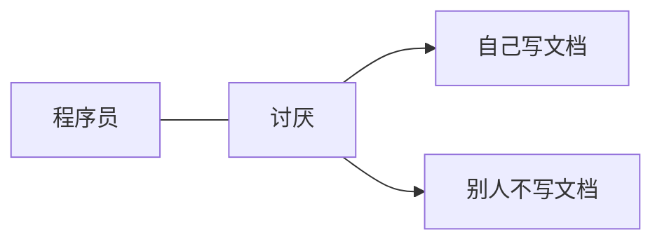

# Toby 瞎写的文档

我会在这里随便放一些文档，不定期更新。




为什么要写文档呢？因为脑子不太好用了，好记性总归比不过烂笔头。

> 永久链接：<https://tobyqin.cn/docs>
>
> 备用链接：<https://tobyqin.github.io/docs>

## 本地运行

1. 安装 Hugo
   ```bash
   # Mac
   brew install hugo
   
   # Windows
   choco install hugo
   ```

2. 克隆仓库
   ```bash
   git clone https://github.com/tobyqin/docs.git
   cd docs
   ```

3. 启动本地服务器
   ```bash
   hugo server -D
   ```

4. 访问 <http://localhost:1313/docs>

---
转载内容请注明出处，谢谢。
