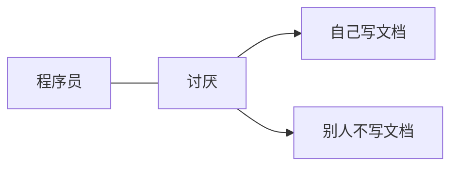

# BetaCat 的文档

我会在这里随便放一些文档，不定期更新。


<!-- tabs:start -->

#### ** Python **

```python
print('程序员最讨厌两件事')
print('1. 自己写文档')  
print('2. 别人不写文档')
```

#### ** JavaScript **

```javascript
console.log("What are you looking for?")
console.warn("瞅你咋地？");
```

#### ** Bash **

```bash
echo "Are your kidding me?"
```

<!-- tabs:end -->



为什么要写文档呢？因为脑子不太好用了，好记性总归比不过烂笔头。

> 永久链接：<https://tobyqin.cn/docs>
>
> 备用链接：<https://tobyqin.github.io/docs>

转载内容请注明出处，谢谢。
