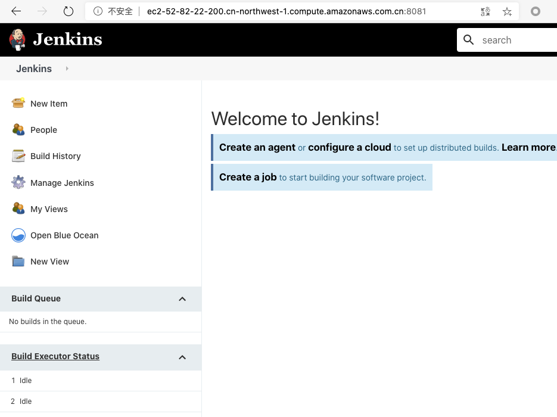

# DevOps 基础设施

在DevOps理念中，我们应当时刻遵循以下理念：

1. 基础设施既代码（Infrastructure as Code）
2. 自动化所有步骤（Automate Everything）

那么在搭建DevOps基础设施时就尽可能用自动化的方式完成，并且基础设施的代码应该托管在代码库中。

## 基础设施规划

在实际项目中，基础设施应该包含软件研发周期（SDLC）的方方面面，可能会包含以下内容：

1. 需求管理平台 （Plan），例如JIRA，TFS等
2. 代码托管平台（Develop），例如Bitbucket，Gitlab等
3. CI/CD服务（Build），例如Jenkins，TeamCity等
4. 代码质量管理单元（Test/Quality），例如SonarQube，自动化测试等
5. 制品管理平台（Package），例如Artifactory
6. 产品部署环境（Deploy），例如K8S，Docker等
7. 发布管理系统（Release），例如uDeploy，ServiceNow等
8. 监控报警系统（Operate），例如ELK，ITRS等
9. 其他支持服务如文档管理，权限管理等等

一整套完善的研发体系不是短时间能够完成的，好在现在很多服务厂商都提供了SaaS服务，只要你有钱，什么都可以买现成的。但买第三方厂商的服务和现有的系统的集成也将会是很大的挑战。

在本次DevOps Pipeline演练中，我们可以将基础设施进行简化，尽可能用已有的SaaS服务，计划如下：

1. 需求管理 - Gitlab.com
2. 代码托管 - Gitlab.com
3. CI/CD 平台 - Jenkins (手动部署)
4. 代码质量 - SonarQube Cloud+单元测试
5. 制品管理 - Artifactory
6. 产品环境 - AWS ECS2 （自动部署）
7. 发布管理 - Gitlab.com 分支管理实现
8. 监控系统 - Elastic Cloud
9. 其他支持服务，文档 - Github Pages

## 基础设施实施

在规划中，我们只需要手动部署Jenkins CI/CD 平台，其他都使用现成的SaaS服务。Jenkins的部署比较简单，在AWS中启动一个T2 Medium 的EC2 实例后，根据官网文档几分钟就可以完成部署。

### 配置EC2实例

启动EC2实例截图：


在真正安装Docker和Jenkins前，需要配置好系统的国内源，否则后续流程会非常痛苦。参阅以下文档：

- https://developer.aliyun.com/mirror/

首先配置Ubuntu的更新源：

```bash
# /etc/apt/sources.list
deb http://mirrors.aliyun.com/ubuntu/ xenial main
deb-src http://mirrors.aliyun.com/ubuntu/ xenial main

deb http://mirrors.aliyun.com/ubuntu/ xenial-updates main
deb-src http://mirrors.aliyun.com/ubuntu/ xenial-updates main

deb http://mirrors.aliyun.com/ubuntu/ xenial universe
deb-src http://mirrors.aliyun.com/ubuntu/ xenial universe
deb http://mirrors.aliyun.com/ubuntu/ xenial-updates universe
deb-src http://mirrors.aliyun.com/ubuntu/ xenial-updates universe

deb http://mirrors.aliyun.com/ubuntu/ xenial-security main
deb-src http://mirrors.aliyun.com/ubuntu/ xenial-security main
deb http://mirrors.aliyun.com/ubuntu/ xenial-security universe
deb-src http://mirrors.aliyun.com/ubuntu/ xenial-security universe
```

接下来安装Docker：

```bash
# step 1: 安装必要的一些系统工具
sudo apt-get update
sudo apt-get -y install apt-transport-https ca-certificates curl software-properties-common
# step 2: 安装GPG证书
curl -fsSL https://mirrors.aliyun.com/docker-ce/linux/ubuntu/gpg | sudo apt-key add -
# Step 3: 写入软件源信息
sudo add-apt-repository "deb [arch=amd64] https://mirrors.aliyun.com/docker-ce/linux/ubuntu $(lsb_release -cs) stable"
# Step 4: 更新并安装Docker-CE
sudo apt-get -y update
sudo apt-get -y install docker-ce
```

配置Docker镜像加速：

```bash
sudo mkdir -p /etc/docker
sudo tee /etc/docker/daemon.json <<-'EOF'
{
  "registry-mirrors": ["https://ngim31fm.mirror.aliyuncs.com"]
}
EOF
sudo systemctl daemon-reload
sudo systemctl restart docker
```

到此为止，服务器已经畅通无阻可以顺利拉取任意常规镜像了。

### 安装Jenkins

主要步骤遵循官网文档，这里只记录了核心操作。

- https://www.jenkins.io/doc/book/installing/

```
docker network create jenkins

docker volume create jenkins-docker-certs
docker volume create jenkins-data

docker container run \
  --name jenkins-docker \
  --rm \
  --detach \
  --privileged \
  --network jenkins \
  --network-alias docker \
  --env DOCKER_TLS_CERTDIR=/certs \
  --volume jenkins-docker-certs:/certs/client \
  --volume jenkins-data:/var/jenkins_home \
  --publish 2376:2376 \
  docker:dind
  
  docker container run \
  --name jenkins-blueocean \
  --rm \
  --detach \
  --network jenkins \
  --env DOCKER_HOST=tcp://docker:2376 \
  --env DOCKER_CERT_PATH=/certs/client \
  --env DOCKER_TLS_VERIFY=1 \
  --publish 8081:8080 \
  --publish 50000:50000 \
  --volume jenkins-data:/var/jenkins_home \
  --volume jenkins-docker-certs:/certs/client:ro \
  jenkinsci/blueocean
```



至此，基础设施基本搭建完毕。搭建的脚本可以在[这个代码仓库](https://gitlab.com/tobyqin/pipeline2020)中找到。

