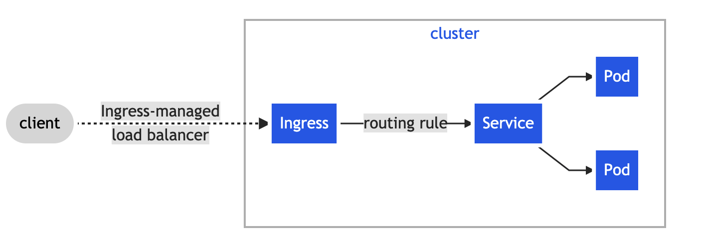

?> In this task, we will expose our application to internet users.

See also https://kubernetes.io/docs/concepts/services-networking/service/

## Service

```yaml
apiVersion: v1
kind: Service
metadata:
  name: kitty-service
spec:
  selector:
    app: kitty
  ports:
    - protocol: TCP
      port: 80
      targetPort: 5000
```

Commands:

```bash
k create -f service.yaml
k get svc

# create a client
k run client --image=busybox -- sleep 360000
k exec -it client -- sh
# wget -O- http://kitty-service
```

## NodePort Service

```yaml
# service-nodeport.yaml
apiVersion: v1
kind: Service
metadata:
  name: kitty-nodeport
spec:
  type: NodePort
  selector:
    app: kitty
  ports:
    # By default and for convenience, the `targetPort` is set to the same value as the `port` field.
    - port: 5000
      targetPort: 5000
```

Commands

```bash
k create -f service-nodeport.yaml

$ k get svc kitty-nodeport  # remember the nodeport 30960
NAME             TYPE       CLUSTER-IP     EXTERNAL-IP   PORT(S)          AGE
kitty-nodeport   NodePort   10.245.44.36   <none>        5000:30960/TCP   2m17s

$ k get node -o wide # remember the external IP
NAME                   STATUS   ROLES    AGE    VERSION   INTERNAL-IP   EXTERNAL-IP
pool-8eal681ba-8agl9   Ready    <none>   105m   v1.20.7   10.104.0.3    165.22.240.39

# Now visit http://165.22.240.39:30960/
```

## Ingress

See more https://kubernetes.io/docs/concepts/services-networking/ingress/



```yaml
# ingress.yaml
apiVersion: networking.k8s.io/v1
kind: Ingress
metadata:
  name: kitty-ingress
spec:
  defaultBackend:
    service:
      name: kitty-service
      port:
        number: 80 # update to another port
```

Commands

```bash
$ k create -f ingress.yaml
ingress.networking.k8s.io/kitty-ingress created

$ k get ingress
NAME            CLASS    HOSTS   ADDRESS          PORTS   AGE
kitty-ingress   <none>   *       159.89.208.222   80      9s

# Now visit http://159.89.208.222/
```

## Shortcut

```bash
k create service --help

# create a node port service
kubectl create service nodeport my-ns --tcp=80:80

# generate yaml and edit it
kubectl create service nodeport my-ns --tcp=80:80 --dry-run=client -o yaml > my-ns.yaml

# create from yaml finally
k create -f my-ns.yaml
```
