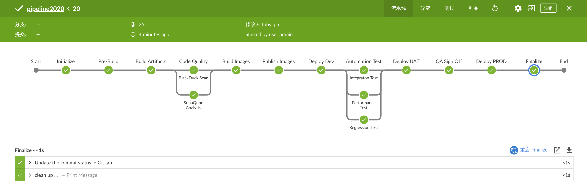
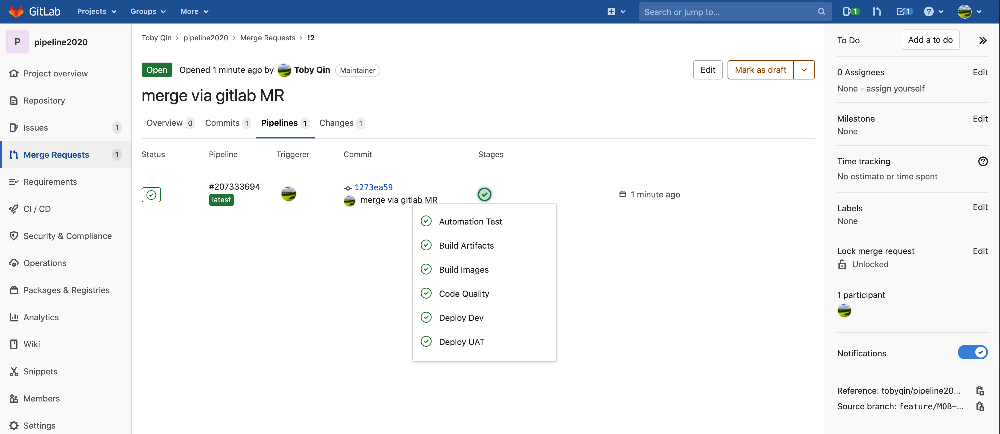

# Jenkins 流水线设计

Demo of awesome pipeline, using Jenkins shared library to build standardized, reusable and optimized CI/CD pipelines.

本文提供了一种易于扩展，维护和度量的 Jenkins 流水线设计思路，仅供参考，本人不对后果负责。

## 应用概述

这是一个非常简单的 Python Web 应用，用 Flask 实现了一个 Xmind 转成 TestCase 的 Web 应用。应用本身并不是重点，本项目重点要分享的是一种实现标准化的，可复用且灵活的 Jenkins Pipeline 实现思路，具体细节请阅读以下文档。

## 流水线阶段描述

流水线主要设计了以下阶段（概念）。

### Pre Build

用于自定义编译前的前置步骤，是可选步骤，有开发人员自定义。

### Build Artifacts

用于编译和打包应用程序，该过程会自动运行项目中的单元测试。

### Code Quality

用于检测代码质量，利用 SonarQube 扫描代码规范和单测覆盖率，利用 BlackDuck 和 CheckMarx 检测应用的安全和合规性问题。

### Build Images

此阶段可以将应用或其制品打包成 Docker 镜像，是一个可选步骤。

### Publish Images

此阶段依赖于 `Build Images` 的输出，将生成的 Docker 镜像发布到 Artifactory 中。

### Deploy Dev

此阶段将应用部署到 Dev 环境，主要依赖于 `deploy` 目录下的描述文件 `deploy.sh` 和配置文件 `Dev.conf`。

### Integration Test

该阶段将运行自动化集成测试，需要测试团队测试服务化，给 DevOps 提供持续测试的能力。

### Deploy UAT

该阶段会根据当前的分支策略决定是否运行，遵循以下规则：

- 如果当前是可发布分支（分支前缀为 release），则运行该阶段。
- 否则跳过该阶段。

该阶段的部署和 Dev 环境部署脚本一致，只是配置文件有所不同。

### Regression Test

依赖于 Deploy UAT 阶段，UAT 部署完毕后则运行回归测试服务。

### QA Sign Off

此阶段为人工审核阶段，一般在 QA 团队完成功能验证后手动点击确认后流水线继续往下走，否则超时未点击确认则终止流水线。

### Deploy PROD

此阶段为生产环境部署，使用和 Dev，UAT 一样的部署脚本，但配置文件有所不同。

### Finalize

用于自定义部署后的收尾工作，是可选步骤，有开发人员自定义。

### 备注

以上流水线阶段可以根据项目需求选择性打开或者关闭，DevOps 团队会给出规范和最佳实践，针对不同的技术栈也会有样例，可以直接克隆后使用到项目中。比如：

1. PipelineExampleSpringBoot
2. PipelineExampleAngular
3. PipelineExampleFlask

声明：以上皆为流水线设计阶段，限于个人时间原因，并未完全实现，如果你想和我进一步交流，欢迎到[GitHub](https://github.com/tobyqin/)上联系我。

## 工具链描述

在实际项目中，流水线会涉及到软件研发周期（SDLC）的方方面面，可能会包含以下内容：

1. 需求管理平台 （Plan），例如 JIRA，TFS 等
2. 代码托管平台（Develop），例如 Bitbucket，Gitlab 等
3. CI/CD 服务（Build），例如 Jenkins，TeamCity 等
4. 代码质量管理单元（Test/Quality），例如 SonarQube，自动化测试等
5. 制品管理平台（Package），例如 Artifactory
6. 产品部署环境（Deploy），例如 K8S，Docker 等
7. 发布管理系统（Release），例如 uDeploy，ServiceNow 等
8. 监控报警系统（Operate），例如 ELK，ITRS 等
9. 其他支持服务如文档管理，权限管理等等

一整套完善的研发体系不是短时间能够完成的，好在现在很多服务厂商都提供了 SasS 服务，只要你有钱，什么都可以买现成的。但买第三方厂商的服务和现有的系统的集成也将会是很大的挑战。

在本次 DevOps Pipeline 演练中，我进行了一些简化，尽可能使用已有的 SaaS 服务，计划涉及的工具链如下：

1. 需求管理 - Gitlab.com
2. 代码托管 - Gitlab.com
3. CI/CD 平台 - Jenkins (手动部署)
4. 代码质量 - SonarQube Cloud+单元测试
5. 制品管理 - Artifactory
6. 产品环境 - AWS ECS2 （自动部署）
7. 发布管理 - Gitlab.com 分支管理实现
8. 监控系统 - Elastic Cloud
9. 其他支持服务，文档 - Github Pages

## CI/CD 功能

在流水线阶段我们已经涉及了完整的 CI/CD 功能，使用范例如下。

### 一个最简单的 Java 应用

```groovy
pipelineMaven(team:'awesome-team')
```

开发团队只要一行代码就可以完成一个完整功能的 CI、CD 流水线。

### 更复杂的应用

```groovy
pipelineAngular(
  // team is required
  team: 'my-team',

  // imageName is optional, if not provided will use repo name
  imageName: 'gsp-demo-service',

  /* All configurations list below are optional */

  // enables to build and deploy multiple services and their container images
  images: null,

  // to define your build agent, valid options: jdk8, jdk11, nodejs, nodejs10, python36, dotnet
  agentLabel: "jdk8",

  // set component name
  componentName: "MyComponentName",

  // set pipeline timeout, default 60
  timeoutMinutes: 60,

  // customize release branch pattern, branch match this pattern will be publish to UCD
  releaseBranchPattern: "master|.*release.*",

  // customize branch pattern to build image, all branches applied by default
  buildImageBranchPattern: ".*",

  // customize branch pattern for "Test Deploy" stage, all branches applied by default
  deployImageBranchPattern: ".*",

  // get target deploy environment name, required for stage "Deploy *"
  getDeployEnvNameFunc: { return "DEV" },

  // get the deploy process to be trigger, default return "Deploy"
  getDeployProcessFunc: { return "Deploy" },
```

开发团队可以针对不同的场景配置不同的参数，但是所有的流水线步骤是预定义好的，由 DevOps 团队定制和优化。

### Jenkins Shared Library 设计和说明

> https://gitlab.com/tobyqin/jenkins-pipeline-library

在 Shard Library 中，主要有 3 个核心实现：

1. 流水线阶段定义 pipelineBase
2. 流水线模块化阶段 pipelineSteps
3. 预定义的流水线模板 pipelineTemplates

#### PipelineBase

在 pipelineBase 中，我们预定义好标准化的流水线，代码大致如下：

```groovy
pipeline {
    agent {
      label config.agentLabel ?: config.defaultAgentLabel
    }
    options {
      timeout time: pipelineTimeoutMinutes, unit: 'MINUTES'
      parallelsAlwaysFailFast()
    }

    stages {
      stage('Initialize') {
        steps {
          script {
            //set environment variables
            helper.setEnvVars(config)
            stepInitialize()
          }
        }
      }
      stage("Pre-Build") {
        when { expression { return helper.isCurrentStageEnabled() } }
        steps {
          script {
            if (config.preBuildFunc) {
              config.preBuildFunc()
            }
          }
        }
      }
      stage('Build Artifacts') {
        when { expression { return helper.isCurrentStageEnabled() } }
        steps {
          script {
            config.buildArtifactsFunc()
          }
        }
        post {
          success {
            script {
              if (config.postBuildSuccessFunc) {
                config.postBuildSuccessFunc()
              }
            }
          }
        }
      }
      stage('SonarQube Analysis') {
        when {
          expression { return helper.isCurrentStageEnabled() }
        }
        steps {
          script {
            config.sonarFunc()
          }
        }
        post {
          success {
            script {
              if (config.postSonarSuccessFunc) {
                config.postSonarSuccessFunc()
              }
            }
          }
        }
      }
      // 以下阶段省略
    }
}
```

#### pipelineSteps

在流水线阶段，DevOps 团队提供基础的步骤定义，开发团队和测试团队也可以贡献自己的步骤。示例如下：

```groovy
// 以下步骤由DevOps团队提供
stepInitialize()
stepGradleBuild()
stepSonarScan()
stepBlackDuckScan()
stepDockerBuild()
stepDeploy()
stepFinalize()

// 以下步骤由测试团队提供
stepAutomatedTest()
stepQASignOff()
```

每个步骤可以提供一定的参数，例如：

```groovy
stepSonarScan(
    ["sonar.verbose": "true"]
)
```

#### pipelineTemplates

针对于常见的技术栈应用，在 Shared Library 中可以预先配置好相应步骤，开发团队只需要几行代码即可完成一个全功能流水线，示例如下。

```groovy
pipelineGradle(
  agentLabel: 'jdk8',
  buildArtifactsFunc: {
    sh "./build.sh"
  }
)
```

DevOps 团队可以实现以下流水线：

1. pipelineGradle
2. pipelineMaven
3. pipelinesAngular
4. pipelinePythonWeb

实现的方式也非常易于维护和扩展，示范如下：

```groovy
// pipelineMaven.groovy
def call(Map config) {
    final build = {
        sh 'mvn clean package verify'
    }

    Map sonarParams = ["sonar.language": "java"]

    if (config.sonarCustomParameters) {
        sonarParams = sonarParams << config.sonarCustomParameters
    }

    if (!config.sonarFunc) {
        config.sonarFunc = {
            stepMavenSonarAnalysis(sonarParams)
        }
    }

    if (config.enableSonarAnalysis == null) {
        config.enableSonarAnalysis = true
    }


    env.PIPELINE_TYPE = "Maven"
    config.defaultAgentLabel = 'jdk8'
    config.defaultBuildArtifactsFunc = build
    config.sonarCustomParameters = sonarParams

    gspPipelineBase(config)
}
```

以上流水线继承了 `pipelineBase` 的基础功能，针对 maven 项目重写了 `buildArtifact` 的功能，并且设定了 maven 项目需要的一些环境变量和参数。

在真实项目中，可能这样的流水线还会复杂一些，但实现和维护起来并不会很困难。

## 演示说明

基本演示流程如下：

1. 在需求管理系统创建需求卡片，每个需求卡片具有唯一 ID
2. 开发人员基于需求卡片 ID 创建功能分支，例如 feature/MOB-1122
3. 开发人员在本地开发环境实现具体功能，并为新代码添加单元测试
4. 开发人员将代码推送到运程仓库，DevOps 流水线自动被触发，测试流水线运行在功能分支
5. 功能分支的流水线只会部署到 Dev 环境
6. 当开发人员认为功能已经完成后，可以开始提 Pull Request 将功能分支合并至主干分支 Master
7. 在 Pull Request 页面会自动显示此开发分支流水线的最终状态，以辅助代码审核人员审核代码
8. 当审核通过后代码合并至主干分支，流水线基于主干分支运行，最终会部署至 UAT 环境
9. 所有自动化测试也将完成，然后提测到 QA 团队，进行最后的探索测试
10. 探索测试结束后，功能进入预发布状态
11. 预发布状态的功能可以选择直接上线 PROD，也可以选择等待其他功能一起发布。

### 流水线运行设计



### 和 Gitlab MR 集成



### 声明

本项目主要用于阐述 DevOps 流水线理念和方法，大多数功能并未实现，如果想和我进一步沟通，通过以下方式找到我。

- GitHub: https://gitlab.com/tobyqin
- Blog: https://tobyqin.cn/

最后也感谢[中国 DevOps 社区](https://Pipeline.DevOpsMeetup.com)举办的这次活动，虽然自己的项目基本没完成，但是看到了行业很多精彩的案例分享，收获良多。

如需转载本项目源码，请注明出处，谢谢。
