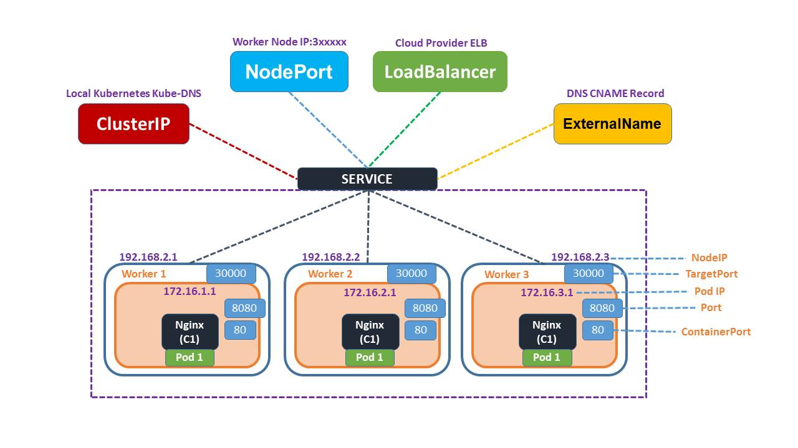
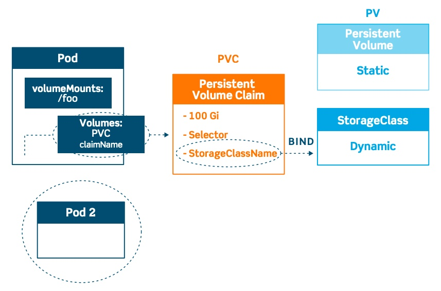

In this page, we will introduce core concepts in k8s.

**`Kubernetes` is a container orchestration platform.** What does that mean? Think about Google, and the incredible scale they need to support and deploy on their systems.

## Container

**Containers Offer Immutable Delivery**, immutable delivery means that you have confidence that the deployment you are handing off to the next person is exactly and precisely what you expect. An immutable image is a package that contains a complete version of your application and all of its dependencies. The immutable image contains everything that your application needs to run in its own isolated space. To learn more, you can visit this link: https://www.docker.com/resources/what-container.

## Kubernetes Architecture


### Control Plane (master node)

On top of the nodes, there is a set of master nodes that acts as a control plane and presents an API for the various worker nodes. The control plane plays a role in deployments and in directing traffic. The control plane selects desired nodes and deploys pods.

### Worker node

A worker machine, which can be a virtual machine, bare metal, or any machine running the `kubelet` and the the `kube-proxy`. The node is available to the Kubernetes master. The Kubernetes master deploys resources onto the node.

## Manifest file

A Kubernetes file that indicates which objects to use and their attributes, written in YAML. It declares which objects you want to have Kubernetes deploy for you.

In the `.yaml` file for the Kubernetes object you want to create, you'll need to set values for the following fields:

`apiVersion` - Which version of the Kubernetes API you're using to create this object
`kind` - What kind of object you want to create
`metadata` - Data that helps uniquely identify the object, including a name string, UID, and optional namespace
`spec` - What state you desire for the object

The precise format of the object spec is different for every Kubernetes object, and contains nested fields specific to that object. The [Kubernetes API Reference](https://kubernetes.io/docs/reference/generated/kubernetes-api/v1.21/) can help you find the spec format for all of the objects you can create using Kubernetes.

Example of Manifest file:

```yaml
# deploy.yaml
apiVersion: apps/v1
kind: Deployment
metadata:
  name: nginx-deployment
spec:
  selector:
    matchLabels:
      app: nginx
  replicas: 2 # tells deployment to run 2 pods matching the template
  template:
    metadata:
      labels:
        app: nginx
    spec:
      containers:
        - name: nginx
          image: nginx:1.14.2
          ports:
            - containerPort: 80
```

## Pod


Inside of a node, you have one or more pods. Pods are the deployable units in Kubernetes. It is the most basic building block of deployment within Kubernetes. Think of a pod as the unit component of compute workload. The pod indicates which containers you are going to run as a unit.

**Pod overview**


**Pod lifecycle**


**Pod design pattern**


## ReplicaSet


Pods are created by a ReplicaSet. A ReplicaSet indicates N number of replicas, minimum and maximum. For example, ReplicaSet decides where to put 10 replicas of a container image running and how to distribute the deployment and the traffic. ReplicaSet is at the pod level and delegates local container restarts to the `kubelet`.

## Deployment


Manages the lifecycle of a ReplicaSet.

## Service



A service gives you one entry point into a variable number of pods. Services can be exposed outside the cluster through an external LoadBalancer. All public cloud managed Kubernetes services automate the creation of native load balancers for your services.

## Persistent Volume



A `PersistentVolume` (PV) is a piece of storage in the cluster that has been provisioned by an administrator or dynamically provisioned using Storage Classes.

While `PersistentVolumeClaims` allow a user to consume abstract storage resources, it is common that users need `PersistentVolumes` with varying properties, such as performance, for different problems.

## ConfigMap

A `ConfigMap` is an API object used to store non-confidential data in key-value pairs. Pods can consume `ConfigMaps` as environment variables, command-line arguments, or as configuration files in a volume.

A `ConfigMap` allows you to decouple environment-specific configuration from your container images, so that your applications are easily portable.

## Secrets

A `Secret` is an object that contains a small amount of sensitive data such as a password, a token, or a key. Such information might otherwise be put in a Pod specification or in an image. Users can create Secrets and the system also creates some Secrets.

It is similar as `ConfigMap`, just to separate the sensitive data.
