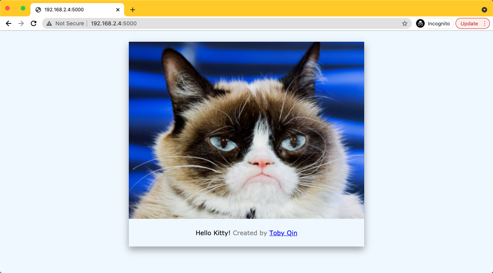

?> We will walk through to build and run a simple docker image in this task.

Source code: https://github.com/tobyqin/hello-docker



## Dockerfile

```Dockerfile
FROM frolvlad/alpine-python3:latest

WORKDIR /app
COPY requirements.txt requirements.txt
RUN pip3 install -r requirements.txt
COPY . .
ENV FLASK_APP='app'

# customization
ENV NAME='Toby Qin'
ENV SITE='https://tobyqin.cn'
ENV MESSAGE='Kitty'
ENV IMAGE=''

EXPOSE 5000
CMD [ "python3", "app.py"]
```

## Commands

```bash
git clone https://github.com/tobyqin/hello-docker.git

cd hello-docker

# build Dockerfile, please change username in the command
docker build -t tobyqin/hello:latest .

# run it
docker run -it --rm -p 5000:5000 tobyqin/hello

# publish to docker hub
docker login
docker push tobyqin/hello
```

