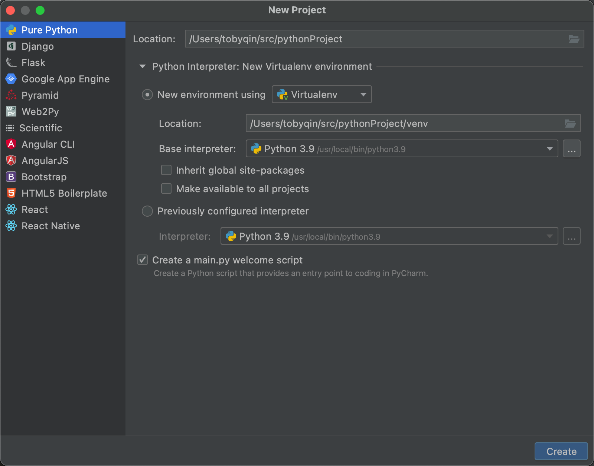

# Python 程序设计基础

这是 Python 程序设计的简明教程。

## 环境准备

环境准备过程中，核心要点如下：

1. 官方下载地址 http://python.org/download/
2. 安装路径，推荐选择用户目录
3. 环境配置，需要将 Python 加入 PATH
4. 开发工具，推荐使用 [PyCharm 社区版](https://www.jetbrains.com/pycharm/)

## 新建项目

在 Python 中新建项目的要点：

1. 选择项目保存地址，按个人习惯输入，例如 `~/workspace`
2. 选择 Python 解释器（interpreter），可以用已经存在的解释器，也可以选择一个虚拟环境。



Python 是解释型语言，解释器可以类比成 Java 的 JDK 版本。我个人非常不推荐直接使用默认的 Python 解释器，因为随着项目的开发我们会引入很多依赖包，每个项目对同一个依赖包的版本可能有所不同，这时候使用同一个解释器会造成依赖混乱，后期排查的难度非常大，那时候再去把项目分离属于没必要的成本。

如果只是学习或者做非专业项目开发，可以使用默认环境。

## 第一个程序

一行代码就可以开启 Python 世界的大门。

```python
print('hello world')
```

用面向对象和动态语言来写第一个程序。

```python
class Employee(object):
    pass

if __name__ == '__main__':
    employee = Employee()
    employee.code = '007'
    employee.name = 'Toby'
```

`Employee` 对象可以不声明`code`和`name`的属性，在程序运行中再给它添加`code`和`name`。

`if __name__ == '__main__’`的意思是这是 Python 程序的入口，这行代码能让很多新手纠结半天。这其实还是简单的 if 判断，关键是`__name__` 和 `__main__` 是什么鬼。

`__name__` 是 Python 模块的名字，双下划线属于 Python 进阶课程的内容，双下划线开头和结尾的变量一般属于 Python 的内置变量，`__name__` 就是其中之一，指的是当前模块的名字。但是，如果当前模块是被直接运行的模块的话，值就等于 `__main__`，否则就等于模块原本的名字。

> 想了解更多双下划线的内容，搜索 “Python 的魔方方法”

我们做一个简单的例子，假设有 a 和 b 两个模块。

```python
# a.py
def what_is_main():
    print('a.__name__ = ' + __name__)

if __name__ == '__main__':
    what_is_main()
```

现在直接运行脚本 `a.py`。

```bash
$ python a.py
a.__name__ = __main__
```

这时候的`__name__`返回的值就是`__main__`。我们来写一个 b 模块，调用 a 模块，然后看看这时候 a 里的`__name__`是什么。

```python
# b.py
import a

a.what_is_main()
```

现在直接运行脚本 `b.py`。

```bash
$ python b.py
a.__name__ = a
```

这个例子看懂了，这个 Python 入门的坎就过去了。
